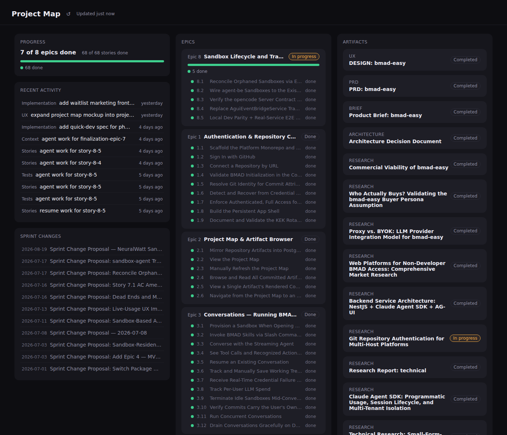

# BMAD Dash

A live dashboard for [BMAD Method](https://github.com/bmad-code-org/BMAD-METHOD) v6 projects, right inside VS Code. See epics, stories, artifacts, and recent activity at a glance — without digging through your planning folders.

## Features

- **Progress** — epics and stories done, with a status ribbon broken down by done / review / in progress / ready for dev / backlog.
- **Epics** — every epic with its status and per-story breakdown. Click an epic to jump straight to its line in `sprint-status.yaml`.
- **Artifacts** — PRDs, briefs, UX designs, architecture docs, and research with completion badges. Click to open the file.
- **Recent activity** — commits touching your BMAD output folder, labeled by area, with links to the commit on GitHub.
- **Sprint changes** — change proposals, newest first. Click to open the proposal.

Everything updates live as files change; a refresh button is there when you want it anyway.

## Requirements

BMAD Dash works in repositories that follow the BMAD v6 layout: a `_bmad/config.toml` with `[modules.bmm]` planning and implementation artifact paths. In repos without it, the extension stays out of the way — no status bar item, no panels.

## Usage

The dashboard opens automatically from the status bar (`$(map) BMAD Map`), or run **BMAD: Show Project Map** from the Command Palette.

## Privacy

BMAD Dash reads files only inside your workspace and makes no network requests of its own. Commit links open in your browser only when you click them.

## License

MIT
